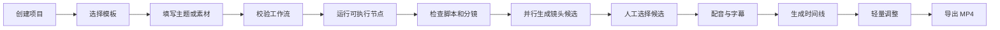
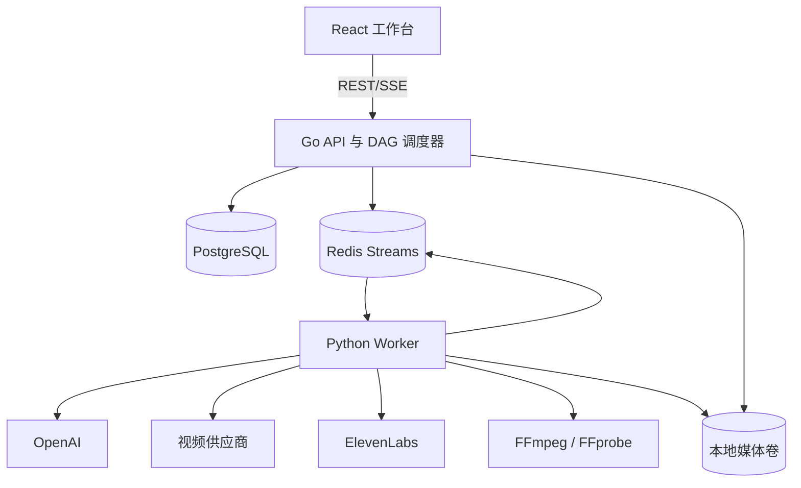
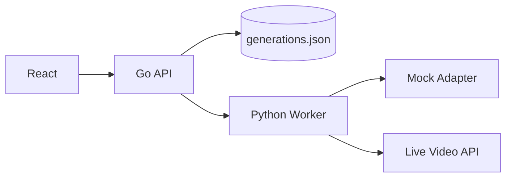

# AI 短视频工作流平台 PRD

> 文档版本：v0.2  
> 产品阶段：纵向切片已实现，完整 MVP 待迭代  
> 目标平台：Windows 11 + Docker Desktop，兼容 Linux Docker Compose  
> 技术栈：React + TypeScript / Go / Python  
> 最后更新：2026-08-31

## 1. 文档目的

本文档用于统一 AI 短视频工作流平台的产品目标、交互范围、运行语义、系统边界、接口契约、测试标准和研发排期。产品、设计、前端、Go 后端、Python/AI 工程师应以本文件作为 MVP 的共同基线。

本文同时区分两个交付阶段：

- **阶段 A：纵向切片**。先证明提示词可以经过 React、Go、Python 和视频供应商接口形成一条可运行链路。
- **阶段 B：完整 MVP**。在已验证的链路上增加项目、素材、可视化 DAG、三套模板、候选选择、局部重跑和轻量时间线。

## 2. 产品概述

### 2.1 一句话定义

一个面向个人创作者、本机私有部署、使用用户自有模型 Key 的可视化 AI 短视频生产工作台。

### 2.2 核心价值

- 将脚本、分镜、图片、视频、配音、字幕和合成串成一条可复用工作流。
- 让用户能检查每个阶段、保留候选、局部返工，而不是每次从头生成。
- 将模型差异收敛到能力适配层，工作流不绑定某个固定模型 ID。
- 素材、密钥、任务和生成结果保留在用户自己的电脑中。

### 2.3 竞品借鉴边界

产品参考[小云雀官方产品](https://xyq.jianying.com/)公开展示的“创意输入—脚本/资产—分镜—逐镜生成—成片返工”方法，但只借鉴通用产品范式。

不得复制小云雀的名称、Logo、插画、视频、提示词文案、页面布局细节、商业标识或其他受保护内容。产品的信息架构、节点视觉、文案和实现必须保持原创。

## 3. 背景与问题

### 3.1 用户现状

AI 视频创作者通常在多个独立工具之间手动传递内容：

1. 在文本模型中写脚本。
2. 手动把脚本拆成镜头。
3. 在图片模型中生成角色、商品或场景参考。
4. 将图片和提示词提交给视频模型。
5. 下载多个候选片段并手工命名。
6. 在语音模型中生成旁白。
7. 在剪辑软件中拼接、加字幕和导出。

这个过程容易丢失版本、重复付费、人物风格漂移，并且某个镜头失败时往往需要重新执行大量上游步骤。

### 3.2 需要解决的核心问题

- **链路碎片化**：内容和素材散落在不同服务、文件夹和聊天记录中。
- **结果不可控**：一键生成缺少中间检查点，失败后只能整体重来。
- **模型耦合**：更换模型时需要改提示词、参数和调用代码。
- **成本不可见**：重复运行、无效候选和全量重做浪费额度。
- **资产不可复用**：角色、场景、商品和镜头提示没有形成结构化资产。

## 4. 用户与场景

### 4.1 目标用户

首版仅面向一类核心用户：熟悉基本 AI 工具、但不愿维护多套脚本的个人短视频创作者。

典型特征：

- 每周制作 3–20 条短视频。
- 可以自行申请并配置模型 API Key。
- 愿意调整提示词和候选结果，但不希望写代码。
- 使用 Windows PC，接受 Docker Desktop 或本地开发工具链。

### 4.2 首发场景

#### 知识视频

输入一个主题、观点或已有文案，生成 15–60 秒知识讲解视频，包含画面、旁白、字幕和转场。

#### 营销视频

输入商品图片、卖点和目标人群，生成短视频广告脚本、镜头、旁白字幕和成片。

#### 剧情视频

输入故事梗概和角色/场景参考，生成短剧情节、分镜和多个视频片段，再合成为短片。

## 5. 产品目标与非目标

### 5.1 MVP 目标

- 用户可在本机完成从创意输入到 MP4 导出的完整流程。
- 用户可通过可视化 DAG 理解并控制每个生成步骤。
- 支持三套开箱即用模板，用户无需从空画布开始。
- 支持并行生成候选、人工选择和失败节点局部重跑。
- 所有模型 Key 由用户提供，并与浏览器和业务日志隔离。
- 任务在应用或机器重启后可以恢复，不丢失已确认产物。

### 5.2 非目标

MVP 不包含：

- 团队空间、账号体系和协作权限。
- 云同步、跨设备访问和公网托管。
- 套餐、平台计费和模型额度代充。
- 模板市场、第三方插件市场和公开分享。
- 短视频平台链接解析或素材抓取。
- 条件表达式、循环节点和通用自动化语言。
- 专业多轨剪辑、关键帧、复杂特效和调色系统。
- 移动端应用。

## 6. 版本范围

### 6.1 阶段 A：纵向切片

状态：已实现。

包含：

- 文生视频参数表单。
- Go 创建、查询、取消和持久化任务。
- Python Worker 的 Mock/Live 适配模式。
- 调用聚合视频生成 API，轮询异步结果。
- 统一任务状态和视频 URL 提取。
- React 任务列表、进度和视频预览。
- Docker Compose、测试和冒烟脚本。

阶段 A 不包含工作流画布、项目、素材库和时间线。

### 6.2 阶段 B：完整 MVP

包含项目管理、素材库、可视化 DAG、三套模板、完整节点目录、运行控制台、候选选择、局部重跑、轻量时间线和导出。

### 6.3 优先级

- **P0**：缺失即不能发布 MVP。
- **P1**：发布后第一个小版本补齐。
- **P2**：验证用户需求后再决定。

## 7. 产品指标

### 7.1 产品验收指标

- 三套模板均能从输入生成合法的 MP4。
- 一个失败镜头可以单独重跑，不重复执行已成功的无关节点。
- 更改上游内容后，所有受影响下游节点在 2 秒内标记为 `stale`。
- 应用重启后，项目、工作流版本、运行状态和产物仍然存在。
- API Key 不出现在浏览器响应、本地业务 JSON、SSE、应用日志和错误堆栈中。

### 7.2 性能目标

- 100 个节点的画布仍可完成拖动、连线、缩放和选择。
- Go 调度层从接收运行请求到投递首个可运行节点不超过 2 秒。
- Worker 状态变化在 2 秒内反映到前端。
- 不含外部模型耗时的本地接口 P95 小于 300 ms。
- 60 秒时间线在普通桌面电脑上可以生成低清预览代理文件。

### 7.3 不可承诺指标

端到端生成耗时、生成成功率、画面质量和模型成本取决于第三方供应商，不作为平台硬性 SLA。平台必须准确展示供应商状态和错误，不得伪造进度。

## 8. 信息架构

### 8.1 一级页面

1. **项目首页**：创建、打开、复制和删除项目，展示更新时间和磁盘占用。
2. **模板选择**：知识、营销、剧情和空白工作流。
3. **工作流工作台**：画布、节点配置、素材库、运行控制台和结果预览。
4. **时间线**：对已选择镜头做必要调整并导出。
5. **模型设置**：配置供应商、测试连接、查看模型/声音和掩码 Key。

### 8.2 工作台布局

- 顶部：项目名、工作流版本、保存状态、校验、运行、取消和导出入口。
- 左侧：节点目录与素材库切换。
- 中间：可缩放 DAG 画布。
- 右侧：选中节点的参数、输入、输出和历史结果。
- 底部：运行控制台，显示节点队列、进度、耗时、重试和错误。

视觉样式不是 MVP 阻塞项，但信息层级、可访问性、错误可读性和交互反馈属于 P0。

## 9. 核心用户流程

### 9.1 模板成片流程



### 9.2 局部返工流程

1. 用户打开失败或不满意的节点。
2. 修改节点提示词、参数或输入选择。
3. 系统将该节点及所有依赖它的下游节点标记为 `stale`。
4. 旧输出仍可查看，但不得作为“当前有效结果”自动参与新运行。
5. 用户选择“仅重跑当前节点”或“重跑当前节点及下游”。
6. 新输出完成后，用户可以保留旧候选或选择新候选。

### 9.3 并行候选流程

1. 图片或视频生成节点将候选数设置为 2–4。
2. 调度器将候选拆为并行任务，受全局并发限制控制。
3. 候选选择节点在上游候选完成后进入 `waiting_user` 交互状态。
4. 用户选择一个候选作为有效输出。
5. 下游节点仅消费被选中的 `ArtifactRef`。

## 10. 功能需求

### 10.1 项目与素材

| 编号    | 优先级 | 需求                             | 验收标准                                     |
| ------- | ------ | -------------------------------- | -------------------------------------------- |
| PRJ-001 | P0     | 创建、重命名、复制、删除项目     | 删除前明确展示将删除的本地文件大小并二次确认 |
| PRJ-002 | P0     | 展示项目更新时间、模板和磁盘占用 | 数据来自本地存储统计，不估算远程供应商内容   |
| AST-001 | P0     | 上传图片、视频和音频             | 支持中文文件名，记录 MIME、尺寸、时长、哈希  |
| AST-002 | P0     | 素材缩略图和媒体预览             | 失败时展示可恢复错误，不阻塞其他素材         |
| AST-003 | P0     | 素材引用追踪                     | 被工作流引用的素材删除前展示影响范围         |
| AST-004 | P1     | 角色、场景、商品标签             | 标签只在本机项目内使用                       |

### 10.2 工作流画布

| 编号    | 优先级 | 需求                             | 验收标准                              |
| ------- | ------ | -------------------------------- | ------------------------------------- |
| DAG-001 | P0     | 拖入、移动、复制、禁用、删除节点 | 所有操作可撤销/重做，保存后位置不漂移 |
| DAG-002 | P0     | 强类型端口连线                   | 类型不兼容时拒绝连线并说明期望类型    |
| DAG-003 | P0     | 无环校验                         | 新连线导致环路时立即拒绝              |
| DAG-004 | P0     | 并行分支和汇合                   | 不依赖彼此的节点可以并行运行          |
| DAG-005 | P0     | 工作流版本快照                   | 每次正式运行引用不可变版本            |
| DAG-006 | P0     | 保存为本地模板                   | 模板不包含 API Key 和项目私有产物     |
| DAG-007 | P1     | 节点搜索和分类                   | 100 个节点时仍可快速定位              |

### 10.3 运行控制

| 编号    | 优先级 | 需求                 | 验收标准                               |
| ------- | ------ | -------------------- | -------------------------------------- |
| RUN-001 | P0     | 校验后运行整个工作流 | 缺少输入、模型或 Key 时不投递任务      |
| RUN-002 | P0     | 从指定节点运行       | 复用仍有效的上游产物                   |
| RUN-003 | P0     | 局部重跑             | 正确标记并处理受影响下游节点           |
| RUN-004 | P0     | 取消运行             | 未开始任务不再投递，运行中任务尽力取消 |
| RUN-005 | P0     | 自动重试             | 仅可重试错误指数退避三次               |
| RUN-006 | P0     | 重启恢复             | 已确认队列和产物不丢失                 |
| RUN-007 | P0     | 缓存复用             | 缓存命中可见，用户可强制重跑           |
| RUN-008 | P1     | 运行费用元数据       | 只展示供应商返回的用量，不虚构统一价格 |

### 10.4 候选结果

| 编号    | 优先级 | 需求                  | 验收标准                               |
| ------- | ------ | --------------------- | -------------------------------------- |
| CAN-001 | P0     | 同屏查看图片/视频候选 | 显示模型、参数、时间、状态和来源节点   |
| CAN-002 | P0     | 选择当前候选          | 选择动作形成可审计事件并触发下游可运行 |
| CAN-003 | P0     | 保留旧候选            | 重跑不得自动删除历史产物               |
| CAN-004 | P1     | 候选备注              | 备注随项目存储，不写入媒体文件         |

### 10.5 轻量时间线

| 编号   | 优先级 | 需求          | 验收标准                                   |
| ------ | ------ | ------------- | ------------------------------------------ |
| TL-001 | P0     | 镜头排序      | 调整后持续时间和预览顺序同步更新           |
| TL-002 | P0     | 入点/出点裁剪 | 不修改原文件，以 EDL 方式保存              |
| TL-003 | P0     | 替换镜头      | 可从该节点历史候选中选择                   |
| TL-004 | P0     | 基础转场      | 首版仅无转场、淡入淡出和交叉溶解           |
| TL-005 | P0     | 字幕样式      | 字体、字号、颜色、位置、描边使用预设参数   |
| TL-006 | P0     | 音量          | 支持原声、旁白、BGM 三类音量和静音         |
| TL-007 | P0     | 导出          | MP4 H.264/AAC，9:16、16:9、1:1，最高 1080p |
| TL-008 | P1     | 低清代理预览  | 不重复调用生成模型，不修改原媒体           |

## 11. 节点目录与契约

### 11.1 端口类型

首版端口类型固定为：

- `text`
- `script`
- `storyboard`
- `image`
- `video`
- `audio`
- `subtitle`
- `timeline`
- `artifact_list`

端口必须声明是否必填、是否允许多个输入，以及接受的具体媒体约束。不得通过 `any` 绕过类型校验。

### 11.2 P0 节点

| 节点       | 主要输入             | 主要输出                       | 执行方             |
| ---------- | -------------------- | ------------------------------ | ------------------ |
| 文本输入   | 用户文字             | `text`                         | Go                 |
| 本地素材   | 本地文件             | 对应媒体类型或 `artifact_list` | Go/Python          |
| 脚本生成   | `text`               | `script`                       | OpenAI Adapter     |
| 分镜拆解   | `script`             | `storyboard`                   | OpenAI Adapter     |
| 提示词构建 | 分镜、参考资产       | `text`                         | OpenAI Adapter     |
| 图片生成   | 提示词、参考图       | `image` 或列表                 | OpenAI Adapter     |
| 视频生成   | 提示词、参考图       | `video` 或列表                 | Video Adapter      |
| 语音生成   | 文案、声音设置       | `audio`                        | ElevenLabs Adapter |
| 字幕对齐   | 文案、音频           | `subtitle`                     | OpenAI/Python      |
| 候选选择   | `artifact_list`      | 单个媒体产物                   | Go + 用户交互      |
| 镜头裁剪   | `video`、时间参数    | `video` 引用                   | Python/FFmpeg      |
| 转场       | 相邻视频、类型       | 时间线片段                     | Python/FFmpeg      |
| 合成       | 视频、音频、字幕     | `timeline`                     | Python             |
| 导出       | `timeline`、编码设置 | `video`                        | Python/FFmpeg      |

### 11.3 节点定义

```json
{
  "type": "video.generate",
  "version": 1,
  "displayName": "视频生成",
  "inputs": [
    { "name": "prompt", "type": "text", "required": true },
    { "name": "reference", "type": "image", "required": false }
  ],
  "outputs": [
    { "name": "videos", "type": "artifact_list", "itemType": "video" }
  ],
  "config": {
    "provider": "video-compatible",
    "model": "user-selected-model",
    "candidateCount": 2
  }
}
```

## 12. 三套模板

### 12.1 知识模板

```text
主题输入
  → 脚本生成
  → 分镜拆解
  → 提示词构建
  → 图片/视频生成（按镜头并行）
  → 候选选择
  → 旁白生成
  → 字幕对齐
  → 合成
  → 导出
```

默认策略：旁白驱动时长，每个镜头 3–8 秒，默认竖屏 9:16。

### 12.2 营销模板

```text
商品素材 + 卖点输入
  → 广告脚本
  → 镜头拆解
  → 商品参考图/视频生成
  → 候选选择
  → 旁白与字幕
  → 合成
  → 导出
```

商品原图必须可追溯；模型生成画面不得覆盖原素材文件。

### 12.3 剧情模板

```text
故事梗概
  → 角色/场景定义
  → 剧本生成
  → 分镜拆解
  → 角色与场景参考图
  → 逐镜视频生成
  → 候选选择
  → 对白/旁白
  → 字幕
  → 合成与导出
```

角色和场景描述以结构化资产注入每个镜头提示词。MVP 不训练 LoRA，也不承诺跨镜头绝对一致。

## 13. 状态与运行语义

### 13.1 节点状态

- `pending`：尚未进入队列。
- `queued`：已投递，等待 Worker。
- `running`：本地处理或供应商请求正在执行。
- `waiting_provider`：供应商已接收异步任务，等待远程结果。
- `waiting_user`：等待用户选择候选或确认内容。
- `succeeded`：本版本输入下执行成功。
- `failed`：执行失败且重试已结束或错误不可重试。
- `canceled`：用户或系统取消。
- `stale`：曾经成功，但输入或上游版本已改变。

阶段 A 已实现除 `waiting_user` 外的主要异步状态；阶段 B 补齐完整 DAG 语义。

### 13.2 运行状态

`draft → validating → queued → running → succeeded / partially_succeeded / failed / canceled`

存在 `waiting_user` 节点时，运行保持 `running`，并在 UI 明确提示需要人工操作。

### 13.3 失效规则

以下变化使当前节点及全部可达下游节点变为 `stale`：

- 输入值或输入资产变化。
- 节点配置、模型 ID 或节点版本变化。
- 上游有效候选变化。
- 工作流连线变化。

仅调整画布位置、缩放或备注不触发失效。

### 13.4 缓存键

缓存键由以下值经过规范化 JSON 后计算 SHA-256：

```text
workflowVersionId
nodeType + nodeVersion
normalizedNodeConfig
provider + modelId
normalizedPrompt
orderedInputArtifactHashes
```

缓存只复用成功且文件仍存在的产物。用户可以选择“强制重跑”，该动作生成新 NodeRun，但不删除旧缓存。

### 13.5 重试

- 网络中断、HTTP 429、供应商 5xx 和可恢复超时：最多三次指数退避。
- 无效 Key、余额不足、参数错误、内容拒绝：不自动重试。
- 已创建供应商异步任务但本地响应丢失时，必须使用幂等键或保存供应商任务 ID，避免重复扣费。

## 14. 视频供应商接口

### 14.1 当前接入

基础地址：`https://api.jusuanhub.com:10443`

创建任务：

```http
POST /v1/media/generations
Authorization: Bearer <API_KEY>
Idempotency-Key: <UUID>
Content-Type: application/json
```

```json
{
  "model": "minimax-h3",
  "prompt": "生成一个红色的奥迪R8跑车，在山地公路上飙车的激情视频。",
  "generationMode": "t2v",
  "resolutionTier": "768p",
  "orientation": "portrait",
  "seconds": 15
}
```

创建响应返回 `jobId`。Worker 使用相同模型 ID 轮询任务：

```http
GET /v1/jobs/{job_id}?model={model}
Authorization: Bearer <API_KEY>
```

任务成功后读取 `assets[0].assetId`，再下载视频内容：

```http
GET /v1/assets/{asset_id}/content?model={model}
Authorization: Bearer <API_KEY>
```

两条路径分别通过 `VIDEO_API_JOB_PATH_TEMPLATE` 与 `VIDEO_API_ASSET_PATH_TEMPLATE` 配置，不写死在业务节点中。

### 14.2 响应归一化

Worker 兼容以下常见字段：

- 任务 ID：优先读取 `jobId`，并兼容 `job_id`、`id`、`task_id`、`request_id`。
- 状态：`status`、`task_status`、`state`。
- 进度：`progress`，允许 `0–1` 或 `0–100`。
- 成片资源：优先读取 `assets[].assetId`，并兼容供应商直接返回的视频 URL。

归一化状态必须输出平台状态，供应商原始状态可以作为调试元数据保存，但不得直接驱动前端业务逻辑。

### 14.3 模型参数

模型 ID、支持分辨率、方向、时长和参考资产限制来自 Provider Capability，不固化在节点类型中。用户选择模型后，前端仅展示该模型支持的参数。

## 15. 技术架构

### 15.1 目标架构



### 15.2 阶段 A 架构

为优先验证链路，阶段 A 使用本地 JSON 替代 PostgreSQL/Redis：



Go 对前端协议和 Worker 接口保持稳定；阶段 B 替换持久化和队列时不改变前端 Generation API。

### 15.3 服务职责

#### React

- 项目、素材、画布、节点参数、运行状态、候选和时间线交互。
- 不持有供应商 Key。
- 不直接调用模型供应商。

#### Go

- 业务数据唯一写入入口。
- DAG 校验、版本、调度、缓存、失效、运行状态和 SSE。
- Provider Key 加密与掩码配置。
- 项目、素材元数据和时间线 EDL 管理。

#### Python

- 供应商 SDK/HTTP 适配。
- 异步轮询、媒体下载和结果归一化。
- FFmpeg/FFprobe、缩略图、字幕对齐和最终合成。
- 通过队列或内部 API 回传结果，不直接修改业务数据库。

## 16. 数据模型

### 16.1 核心实体

- `Project`
- `Asset`
- `ProviderConfig`
- `Workflow`
- `WorkflowVersion`
- `NodeInstance`
- `Edge`
- `Run`
- `NodeRun`
- `ArtifactRef`
- `Timeline`
- `TimelineTrack`
- `TimelineClip`
- `ExportJob`

### 16.2 关键字段

#### WorkflowVersion

```json
{
  "id": "wfv_...",
  "workflowId": "wf_...",
  "revision": 12,
  "graphHash": "sha256:...",
  "nodes": [],
  "edges": [],
  "createdAt": "2026-08-31T00:00:00Z"
}
```

正式运行必须绑定不可变 `WorkflowVersion`，不得直接绑定可编辑草稿。

#### ArtifactRef

```json
{
  "id": "art_...",
  "kind": "video",
  "storageKey": "projects/.../clip.mp4",
  "sha256": "...",
  "mimeType": "video/mp4",
  "durationMs": 5000,
  "width": 1920,
  "height": 1080,
  "sourceNodeRunId": "nr_...",
  "createdAt": "2026-08-31T00:00:00Z"
}
```

#### NodeRun

必须保存状态、尝试次数、输入快照、缓存键、供应商任务 ID、错误分类、输出产物和时间戳。

## 17. API 契约

API 前缀统一为 `/api/v1`，错误结构统一为：

```json
{
  "error": {
    "code": "provider_auth_failed",
    "message": "视频服务鉴权失败",
    "retryable": false,
    "requestId": "req_..."
  }
}
```

### 17.1 阶段 A 已实现

| 方法 | 路径                              | 用途                     |
| ---- | --------------------------------- | ------------------------ |
| GET  | `/healthz`                        | Go 健康检查              |
| GET  | `/api/v1/config`                  | 获取当前表单默认值与能力 |
| POST | `/api/v1/generations`             | 创建单个文生视频任务     |
| GET  | `/api/v1/generations`             | 列出任务并同步活跃状态   |
| GET  | `/api/v1/generations/{id}`        | 查询单个任务             |
| POST | `/api/v1/generations/{id}/cancel` | 取消任务                 |
| GET  | `/api/v1/generations/{id}/events` | SSE 状态流               |

### 17.2 阶段 B Provider

| 方法 | 路径                           | 用途                        |
| ---- | ------------------------------ | --------------------------- |
| GET  | `/providers`                   | 返回供应商配置掩码和状态    |
| PUT  | `/providers/{provider}`        | 保存加密配置                |
| POST | `/providers/{provider}:test`   | 测试连接，不保存 Key 到日志 |
| GET  | `/providers/{provider}/models` | 返回模型与能力              |
| GET  | `/providers/elevenlabs/voices` | 返回可用声音                |

### 17.3 Project 与 Asset

| 方法             | 路径                            | 用途                 |
| ---------------- | ------------------------------- | -------------------- |
| GET/POST         | `/projects`                     | 项目列表与创建       |
| GET/PATCH/DELETE | `/projects/{id}`                | 项目详情、修改、删除 |
| POST             | `/projects/{id}:clone`          | 复制项目             |
| POST             | `/projects/{id}/assets/uploads` | 创建分片上传         |
| PUT              | `/uploads/{id}/parts/{part}`    | 上传分片             |
| POST             | `/uploads/{id}:complete`        | 校验哈希并完成上传   |
| GET/DELETE       | `/assets/{id}`                  | 素材详情与删除       |

### 17.4 Workflow

| 方法     | 路径                             | 用途               |
| -------- | -------------------------------- | ------------------ |
| GET/POST | `/projects/{id}/workflows`       | 列表与创建         |
| GET/PUT  | `/workflows/{id}`                | 获取与更新草稿     |
| POST     | `/workflows/{id}:validate`       | 返回节点和连线错误 |
| POST     | `/workflows/{id}/versions`       | 创建不可变版本     |
| POST     | `/workflows/{id}:clone-template` | 从模板克隆         |

### 17.5 Run

| 方法 | 路径                                         | 用途                           |
| ---- | -------------------------------------------- | ------------------------------ |
| POST | `/runs`                                      | 启动工作流或指定起点           |
| GET  | `/runs/{id}`                                 | 运行详情                       |
| POST | `/runs/{id}:cancel`                          | 取消运行                       |
| POST | `/runs/{id}/nodes/{nodeId}:rerun`            | 局部重跑                       |
| POST | `/runs/{id}/nodes/{nodeId}:select-candidate` | 确认候选                       |
| GET  | `/runs/{id}/events`                          | 可恢复 SSE，支持 Last-Event-ID |

### 17.6 Timeline 与 Export

| 方法    | 路径                              | 用途             |
| ------- | --------------------------------- | ---------------- |
| GET/PUT | `/projects/{id}/timeline`         | 读取与更新 EDL   |
| POST    | `/projects/{id}/timeline:preview` | 生成代理预览     |
| POST    | `/projects/{id}/exports`          | 创建导出任务     |
| GET     | `/exports/{id}`                   | 查询导出状态     |
| GET     | `/exports/{id}/content`           | 下载本地导出文件 |

## 18. SSE 事件

事件必须具有单调递增 ID，可通过 `Last-Event-ID` 断线续传。

```text
id: 1042
event: node.updated
data: {"runId":"run_1","nodeId":"node_4","status":"running","progress":42}
```

P0 事件类型：

- `run.updated`
- `node.updated`
- `candidate.ready`
- `interaction.required`
- `artifact.ready`
- `export.updated`
- `system.warning`

事件中不得出现 API Key、供应商完整请求头或未经清理的错误响应。

## 19. 密钥与安全

### 19.1 阶段 A

- Key 仅通过 `VIDEO_API_KEY` 进入 Python Worker 进程环境。
- 前端和 Go API 不接收 Key。
- `.env` 被 Git 忽略。

### 19.2 完整 MVP

- 本机生成 256 位 `MASTER_KEY`，或由用户通过环境变量提供。
- Provider Key 使用 AES-256-GCM 加密后存储。
- 每条密文使用独立随机 nonce。
- API 只返回掩码，如 `sk-...a91f`。
- 测试连接时 Key 只在 Go 内存中解密，并通过受控内部请求传给 Worker。
- 日志系统对 `Authorization`、`api_key`、`token` 和已知 Key 值执行清理。

### 19.3 本机暴露面

- 默认只监听 `127.0.0.1`。
- Docker Compose 不暴露 Worker、PostgreSQL 和 Redis 端口。
- 如果以后允许局域网访问，必须先实现身份认证和 TLS，不得仅修改监听地址。

## 20. 本地存储

- 项目文件存入挂载媒体卷，不进入数据库大字段。
- 文件名使用内部 ID，原始文件名作为元数据保存。
- 上传时计算 SHA-256，用于去重、缓存和完整性检查。
- 供应商临时 URL 返回后应立即下载到本地；不得依赖其长期有效。
- 删除项目时先停止相关运行，再删除数据库记录和媒体目录。
- P1 提供磁盘阈值告警和未引用产物清理工具。

## 21. 异常设计

| 场景          | 平台行为                           | 用户动作             |
| ------------- | ---------------------------------- | -------------------- |
| Key 无效      | 任务立即失败，不重试，不泄露原响应 | 前往模型设置更新 Key |
| 余额不足      | 标记不可重试，保留输入             | 充值后手动重跑       |
| HTTP 429      | 根据 Retry-After 或退避重试        | 可取消等待           |
| 供应商 5xx    | 最多三次重试                       | 失败后手动重跑       |
| 内容拒绝      | 显示安全类别的可读提示             | 修改提示词或素材     |
| 查询超时      | 保存供应商任务 ID，状态为失败/未知 | 重新查询或手动确认   |
| 磁盘不足      | 停止新下载和导出                   | 清理本地文件         |
| Worker 重启   | Redis 重新投递未确认任务           | 无需用户操作         |
| 视频 URL 失效 | 若未完成本地下载则标记产物不可用   | 重新获取或重跑       |
| FFmpeg 失败   | 保存命令摘要和安全错误日志         | 修改不兼容素材或重试 |

## 22. 监控与日志

MVP 提供本机可查看的结构化日志和运行诊断页面。

日志字段：

- `request_id`
- `run_id`
- `node_run_id`
- `provider`
- `provider_task_id`
- `status`
- `duration_ms`
- `retry_count`
- `error_code`

日志不得记录完整提示词以外的敏感素材内容；提示词日志应允许用户在设置中关闭。

## 23. 测试计划

### 23.1 单元测试

- DAG 拓扑排序和环路检测。
- 端口类型兼容性。
- 工作流版本哈希。
- 缓存键稳定性。
- 下游 `stale` 传播。
- 重试错误分类。
- AES-GCM 加解密和日志脱敏。
- 时间线入出点和持续时间计算。
- 供应商状态和视频 URL 归一化。

### 23.2 集成测试

- OpenAI、视频供应商和 ElevenLabs 使用 Mock Adapter。
- Go 投递任务、Python 确认和结果回传。
- Redis 消费者崩溃后重新投递。
- API/Worker 重启恢复。
- 文件上传、哈希、缩略图和删除引用检查。

### 23.3 在线冒烟

真实供应商测试必须由用户显式启用并在本机设置 Key。CI 不执行在线测试，避免费用和不稳定性。

每家供应商至少测试：

- 有效 Key 成功请求。
- 无效 Key。
- 不支持模型或参数。
- 限流响应。
- 异步任务成功与失败。

### 23.4 端到端验收

- 三套模板分别生成 15 秒和 60 秒成片。
- 覆盖 9:16、16:9、1:1。
- 验证并行候选、人工汇合、局部重跑和取消。
- 验证中文字幕、音量、裁剪、转场和 H.264/AAC 导出。
- 验证中文路径、大文件上传和磁盘不足。
- 验证 Key 不出现在浏览器、SSE、数据库明文字段和日志中。

## 24. 研发排期

假设 3 人全职：前端 1 人、Go 1 人、Python/AI 1 人。

### 第 1–2 周：纵向切片与基础设施

- 完成 React → Go → Python → 视频供应商链路。
- Mock/Live Adapter、本地任务、Docker Compose。
- 项目、素材和 ProviderConfig 数据模型。

### 第 3–4 周：DAG 与运行引擎

- React Flow 画布、节点协议、类型校验和版本快照。
- PostgreSQL、Redis Streams、SSE 和重启恢复。
- 缓存与 `stale` 传播。

### 第 5–6 周：模型与模板

- OpenAI、视频供应商、ElevenLabs 适配。
- 知识、营销、剧情模板。
- 候选分支与人工选择。

### 第 7–8 周：媒体与时间线

- FFmpeg/FFprobe、字幕对齐和代理预览。
- 镜头排序、裁剪、替换、转场、字幕、音量和导出。

### 第 9 周：可靠性与安全

- 失败恢复、重试、缓存、磁盘清理和日志脱敏。
- Key 加密、安装和升级脚本。

### 第 10 周：验收与发布

- 三模板端到端验收。
- 性能修正和安装测试。
- 用户手册、故障排查和 Release Candidate。

## 25. 风险与缓解

| 风险                   | 影响                 | 缓解措施                                              |
| ---------------------- | -------------------- | ----------------------------------------------------- |
| 视频接口状态协议未确认 | 无法正确轮询结果     | 查询路径和响应归一化可配置，真实调用前用 Key 冒烟确认 |
| 模型能力经常变化       | 节点参数失效         | Provider Capability 动态驱动，不写死模型限制          |
| 视频成本高             | 用户反复生成产生费用 | 候选数上限、运行前摘要、缓存和局部重跑                |
| 角色一致性不足         | 剧情模板效果不稳     | 结构化角色资产、参考图注入和逐镜人工确认              |
| 本地部署复杂           | 用户无法启动         | Docker Compose、一键诊断和 Mock 模式                  |
| 媒体文件占用大         | 磁盘耗尽             | 占用统计、阈值告警和未引用文件清理                    |

## 26. 发布准入

满足以下条件才可标记完整 MVP：

- P0 功能全部通过验收，没有阻断级缺陷。
- 三套模板均完成 Mock 和至少一次真实供应商冒烟。
- 断电/重启恢复测试通过。
- Key 与隐私审计通过。
- Windows Docker Desktop 从干净环境安装成功。
- 生成、取消、局部重跑、时间线和导出的关键路径有自动化测试。
- 已提供备份、升级和故障排查说明。

## 27. 已锁定产品决策

- 本机单用户免登录。
- 可视化无环 DAG，支持并行，不支持条件和循环。
- 用户自带 Key，供应商费用由用户承担。
- 首发知识、营销、剧情模板。
- 素材仅本地上传，不解析平台链接。
- 轻量时间线，不做专业剪辑器。
- 输出 15–60 秒、9:16/16:9/1:1、最高 1080p、MP4 H.264/AAC。
- 功能正确性优先于 UI 精修。
